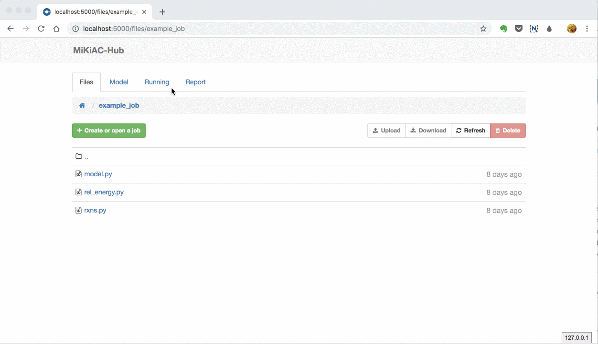

## [Animation] Run a job in scaks-Hub

Here we use GIF animiation to show operations for running a job in scaks-Hub.

- File system in scaks-Hub

- Open an existing job and edit reactions in Reaction Definition panel

- Visualize energy profile for different elementary reaction set

- Edit an existing reaction, scaks-Hub can parse it and do conservation check

- Set all model parameters and run a job to solve the model

- After the job is completed, generate a job report for that run

