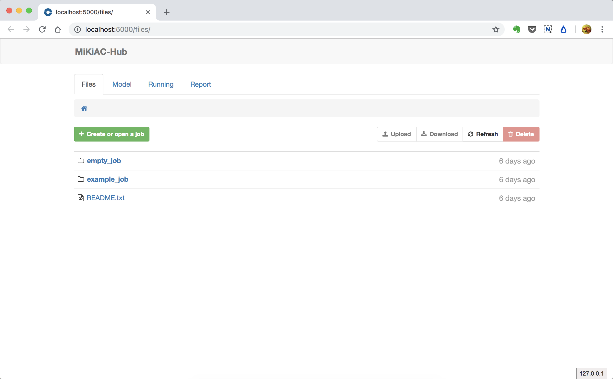
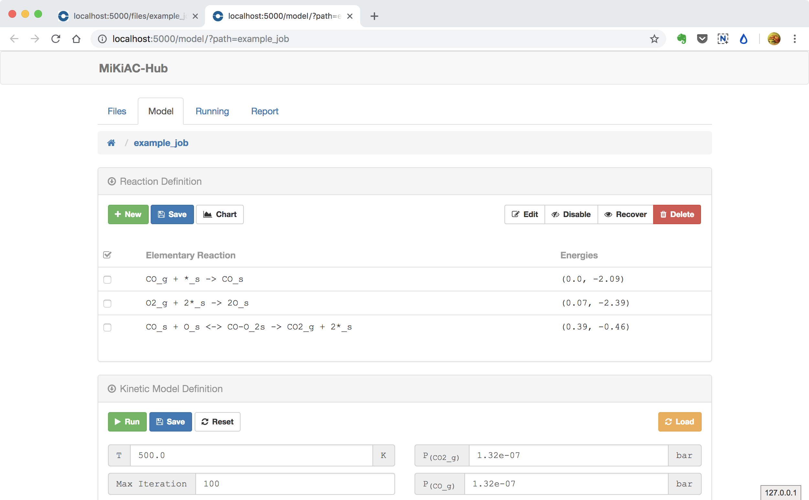
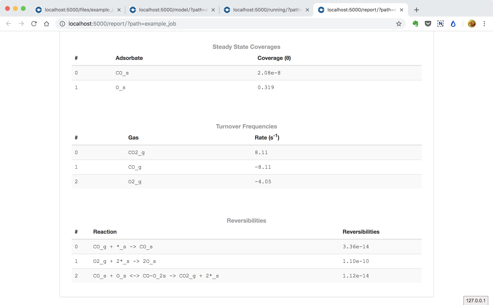

## Solve model in MiKiAC-Hub

MiKiAC also has a web application named MiKiAC-Hub to help researcher build and solve micro-kinetic model more easily.

### File system

MiKiAC-Hub uses a file explorer as the main user interface

### Open an existing model in model panel

Now you can enter the `example_job` directory where model setup file and energy data file have already existed.

Then you can click the green button to open the job panel. MiKiAC-Hub will read all those files and fill the form in model panel automatically.

### Run a job

After all inputs prepared, you can click the green Run button to call mikiac core to solve current model. Then the running panel will be opened and all solving information will be continously updated and displayed in the code block.

The job is running:

The job is finished:

### Generate job report

As the log information is not very friendly for users, MiKiAC-Hub provides a report for each completed job. You can click the green Generate report buttong, then a report panel will be opened. All related results such as ODE integration trajectory, steady state coverages, reversibilities and turnover frequencies.

### Animiation

Here we use a animiation to show all operations above:

