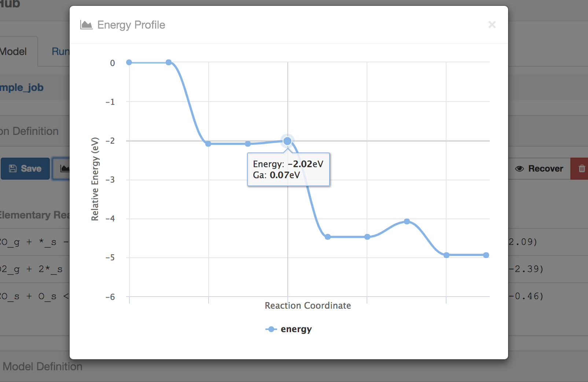

## Build a model in MiKiAC-Hub

In this section, we introduce how to build a micro-kinetic model in MiKiAC-Hub. All information needed for model construction are input in model panel of MiKiAC-Hub. There are two main sub-panel in model panel:

1. Reaction Definition panel: input reaction and energy information
2. Kinetic Model Definition panel: input model conditions and parameters such as temperature, algorithm type and so on.

### Reaction Definition panel

You can add, edit, hide and delete elementary reaction and energy information in Reaction Definition panel

#### Add new elementary reaction

Click the **+ New** button on upper left, a reaction definition modal would pop up for inputing elementary reaction information.

MiKiAC-Hub also can check the correctness of the input reaction expression and energy values.

Energy barrier is less than reaction energy:

Input invalid reaction expression:

#### Edit an existing reaction

If you want to edit an existing reaction, just select its select box at the beginning of the reaction information line and click the **Edit** button, a similar modal with reaction addition will appears.

#### Visualize energy profile

Besides operating elementary reactions, you can also visualize the energy profile for selected reactions:

### Kinetic Definition panel

Kinetic Definition panel is used to input model related parameters such as temperatures, partial pressures for gases, total coverage and solving iteration related parameters

