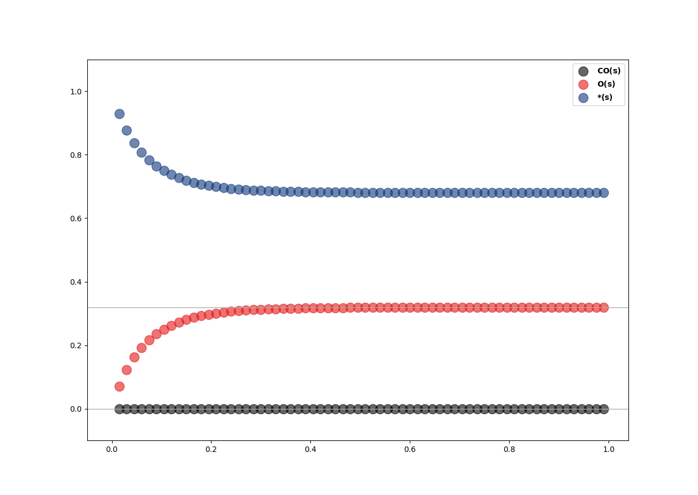

Perhaps the easiest way to get started with your own Micro-kinetic modeling is to have a quick look at a few usage examples. We will take a look at few examples from the simplest CO Oxidation reaction on Pt100 surface using both catynetics API and web GUI.

Solve a micro-kinetic model
-----------------------------

`catynetics.models` module provide different model classes for different kinetic model construction(only micro-kinetic model in current version). Model can constructed from either a setup dict data structure for running in interactive shell or a setup input file for submitting a computing job.

Using setup file
****************

By providing a set of input files including model definition, energy information, script using catynetics API can parse all those files and run the model automatically.

- :obj:`pt-100.mkm`: Input file for micro-kinetic model information::

    rxn_expressions = [
        'CO_g + *_s -> CO_s',
        'O2_g + 2*_s <-> O-O_2s -> 2O_s',
        'CO_s + O_s <-> CO-O_2s -> CO2_g + 2*_s',
    ]

    # Gas pressure.
    species_definitions = {}
    species_definitions['CO_g'] = {'pressure': 1.32*10**-7}
    species_definitions['O2_g'] = {'pressure': 5.26*10**-7}
    species_definitions['CO2_g'] = {'pressure': 1.32*10**-7}

    # Site info.
    species_definitions['*_s'] = {'site_name': 'top', 'type': 'site', 'total': 1.0}

    # Temperature.
    temperature = 500  # K

    unitcell_area = 9.0e-20
    active_ratio = 4./9.

    parser = "RelativeEnergyParser"
    solver = "SteadyStateSolver"
    corrector = "ThermodynamicCorrector"
    plotter = "EnergyProfilePlotter"

    rate_algo = "CT"
    rootfinding = "MDNewton"
    tolerance = 1e-50
    max_rootfinding_iterations = 100

- :obj:`rel_energy.py`: Energy information for each elementary reaction::

    Ga, dG = [], []

    # CO_g + *_s -> CO_s
    Ga.append(0.0)
    dG.append(-2.09)

    # O2_g + 2*_s -> 2O_s
    Ga.append(0.07)
    dG.append(-2.39)

    # CO_s + O_s <-> CO-O_2s -> CO2_g + 2*_s
    Ga.append(0.39)
    dG.append(-0.46)

With these input files prepared, we can use catynetics's API to construct a micro-kinetic model::

    from catynetics.models.micro_kinetic_model import MicroKineticModel

    model = MicroKineticModel(setup_file='pt-100.mkm')

While constructing the model, all model components like parser, solver and plotter are instantialized automatically. Thus, we can use components to parse data and solve model::

    model.parser.parse_data()  # Parse input data
    model.solver.get_data()    # Pass data to solver
    model.run()                # Solve micro-kinetic model

Using setup dictionary
**********************

Setup dictionary is a Python data structure containing essential information for constructing a preliminary Micro-Kinetic Model. It must contain the following informations (keys):

- :obj:`rxn_expressions`: All elementary reaction expressions
- :obj:`species_definitions`: Species information in reaction path such as gas name and partial pressure, adsorption site types and total coverages.
- :obj:`temperature`: Reaction temperation in K
- :obj:`parser`: The parser name for data and input file parsing

The model definition dict for CO oxidation on Pt(100) surface could be written as::

    model_dict = dict(
        rxn_expressions = [
            'CO_g + *_s -> CO_s',
            'O2_g + 2*_s <-> O-O_2s -> 2O_s',
            'CO_s + O_s <-> CO-O_2s -> CO2_g + 2*_s',
        ],

        species_definitions = {
            'CO_g': {'pressure': 1.32e-7},
            'O2_g': {'pressure': 5.26e-7},
            'CO2_g': {'pressure': 1.32e-7},
            '*_s': {'site_name': '111', 'type': 'site', 'total': 1.0},
        },

        temperature = 500,
        parser = "RelativeEnergyParser",
    )

Construct corresponding micro-kinetic model::

    from catynetics.models.micro_kinetic_model import MicroKineticModel
    model = MicroKineticModel(setup_dict=model_dict)

Use constructed model to generate file template for energy data input:

1.Absolute energy input file template::

   model.generate_absolute_energies_file('./abs_energy.py')

Then catynetics will parse all model information in reaction expressions to create a :obj:`abs_energy.py` with below content in current directory::

    # Absolute energies for all species.
    absolute_energies = {

        'CO2_g': 0.0, # eV

        'CO_g': 0.0, # eV

        'O2_g': 0.0, # eV

        'CO_s': 0.0, # eV

        'O_s': 0.0, # eV

        'CO-O_2s': 0.0, # eV

        'O-O_2s': 0.0, # eV

        '*_s': 0.0, # eV

    }

2.Relative energy input file template::

    model.generate_relative_energies_file('./rel_energy.py')

Then catynetics will parse all model information in reaction expressions to create a :obj:`rel_energy.py` with below content in current directory::

    # Relative Energies for all elementary reactions.
    Ga, dG = [], []

    # CO_g + *_s -> CO_s
    Ga.append()
    dG.append()

    # O2_g + 2*_s <-> O-O_2s -> 2O_s
    Ga.append()
    dG.append()

    # CO_s + O_s <-> CO-O_2s -> CO2_g + 2*_s
    Ga.append()
    dG.append()

After inputting energy data in the template file, you can instantialize solver explicitly and put it in micro-kinetic model::

    from catynetics.solvers.steady_state_solver import SteadyStateSolver
    
    solver = SteadyStateSolver(model)
    model.set_solver(solver)

With solver integrated, model can parse data and solve the model::

    model.parser.parse_data('./rel_energy.py')
    model.solver.get_data()
    model.run()

Use script to run a job
***********************

Besides instantiate model using catynetics API, we provide a simple :obj:`run.py` script to parse those input files and solve the micro-kinetic model automatically, the details of the script::

    import logging
    import sys
    import time

    from catynetics.compatutil import subprocess
    from catynetics.mpicommons import mpi
    from catynetics.models.micro_kinetic_model import MicroKineticModel
    from catynetics.utilities.format_utilities import convert_time

    # Custom parameters.
    OdeInterval = 0.001          # ODE integration time interval.
    OdeEnd = 1          # ODE integration time limit.
    OdeOutput = True           # Output ODE integration data or not.
    CalcXRC = True             # Calculate Degree of Rate Control(XRC) or not.
    ProductionName = "CO2_g"  # Production name of your model.
    OdeOnly = False             # Do ODE integration only.

    if "__main__" == __name__:
        # Clean up current dir.
        subprocess.getstatusoutput("rm -rf out.log auto_*")

        # Set script logger.
        logger = logging.getLogger("model.MkmRunScript")

        # Get setup file.
        status, output= subprocess.getstatusoutput("ls *.mkm | tail -1")
        if status:
            if mpi.is_master:
                logger.error(output)
                logger.info("Exiting...")
            sys.exit(1)

        start = time.time()
        try:
            # Build micor-kinetic model.
            model = MicroKineticModel(setup_file=output)

            # Read data.
            parser = model.parser
            solver = model.solver
            parser.parse_data()
            solver.get_data()

            # Initial coverages guess.
            trajectory = solver.solve_ode(time_span=OdeInterval,
                                          time_end=OdeEnd,
                                          traj_output=OdeOutput)
            init_guess = trajectory[-1]

            # Run.
            model.run(init_cvgs=init_guess,
                      solve_ode=OdeOnly,
                      coarse_guess=False,
                      XRC=CalcXRC,
                      product_name=ProductionName)
        except Exception as e:
            if mpi.is_master:
                msg = "{} exception is catched.".format(type(e).__name__)
                logger.exception(msg)
            raise e

        # Time used.
        end = time.time()
        t = end - start
        h, m, s = convert_time(t)

        if mpi.is_master:
            logger.info("Time used: {:d} h {:d} min {:f} sec".format(h, m, s))

Just use Python to execute the script to run the job::

    python run.py

Of course, instead of using built-in script, users can write their own script with mikac API to customize the functionality.

After the solving is finished, new output files are generated in current directory:

- :obj:`out.log`: All output log information such as TOFs, reversibilities, steady state coverages and so on.
- :obj:`data.pkl`: Serialized result data such as turnover frequencies (TOF), steady state coverages and so on. Variable to be dumped is controlled in setup file.
- :obj:`auto_ode_coverages.py`: A python module file containing ODE integration data

With ODE plotting script in catynetics package, the ODE integration trajectory can be visualized:

